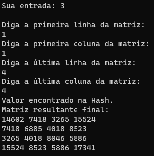
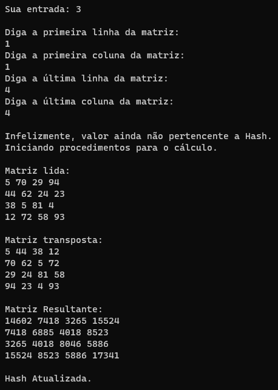

# Trabalho de Aquecimento

<h2><u>Processamento de matrizes por segmentação de arquivo</u>

---
 
## Problema

Neste trabalho, cada aluno deve implementar um sistema de multiplicação de matrizes baseando-se em uma estratégia de segmentação em arquivo. Um arquivo M grande é fornecido no formato NxN com valores de ponto flutuante ou inteiros como entrada. Este é processado a partir de várias coordenadas introduzidas por um segundo arquivo, o coordenadas.txt. Em coordenadas.txt deve ser descrito por linha uma dupla de i e j correspondendo a posição inicial e final a ser lida. Por exemplo, as posições 2,4,6,10 indica que a leitura em M deve iniciar na linha 2 coluna 4 e seguir até a linha 6 coluna 10.

Feito a leitura da composição de M para um tipo matriz em C, a segunda etapa é produzir a transposta de M -= MT. Feito isso, produza a multiplicação e armazene em uma hash o resultado da multiplicação como valor para a dupla de i's e j's, os quais deverão ser utilizados como chaves da hash. Assim, para cada novo calculo, antes o sistema deve consular a hash para identificar se a multiplicação já foi realizada. Em caso afirmativo, retorne apenas a resposta já calculada. Caso contrário, elabore a multiplicação e armazene o conteúdo em cache. 

### Escolha da Linguagem e diferenças do enunciado

Apesar da descrição do problema mencionar C, de acordo com o professor pode-se utilizar de C++, que foi a linguagem utilizada nesse trabalho, pois de acordo com ele este semestre utilizaremos mais a linguagem C++ e o objetivo deste trabalho, como dito no título, é o de ser um aquecimento para o resto do período. Outra diferença é que o trabalho apresentado não realiza ações com ponto flutuante, somente com inteiros.

---

## Lógica

### Menu

Para obedecer o enunciado foram realizados alguns passos e o aluno achou mais interessante de mantê-los como opção para o usuário que fará uso do programa. Com isso, existe um Menu que oferece as opções: 

1. Criar a Matriz, que cairá em um arquivo chamado "Matriz.txt";
2. Ler o arquivo de coordenadas que deve estar exatamente igual ao apresentado no enunciado, tanto em nome, como em formato;
3. Colocar coordenadas manualmente para algum teste específico;
4. Visualizar a Hash atual;
5. Resetar a Hash atual.

### Primeira Opção

Ao escolher a primeira opção, a função criarArquivo será chamada. Nela, será perguntado ao usuário qual o tamanho da matriz (NxM) que este deseja criar. Sempre que esta opção é escolhida, a Hash é reiniciada, pois começará a trabalhar com um arquivo de matriz diferente do que estava utilizando anteriormente. Para a criação da matriz é usado um valor randomico de 0 a 99 para todos os elementos da matriz. Sempre que o valor randomico for menor do que 10, ao salvar no arquivo, um '0' será colocado antes, preservando seu valor e a quantidade de colunas que existem em cada linha do arquivo, tal detalhe é importante para a leitura.

### Segunda Opção

A opção principal dado que foi o pedido do professor. Ao escolher esta opção a função lerArquivoCoordenadas é chamada.

#### lerArquivoCoordenadas

Esta função recolhe as coordenadas do arquivo coordenadas.txt de forma simples, começa a ler a linha caracter por caracter até achar uma vírgula, ao encontrá-la, tudo que está entre um auxiliar inicializado em zero e aquele caracter virgula é considerado a primeira coordenada de linha. O auxiliar é passado para o valor depois da vírgula e a leitura continua, ao ser encontrada a próxima vírgula, tudo que está entre o auxiliar e a vírgula é salvo como a primeira coordenada de coluna. E assim o programa segue até possuir as quatro coordenadas. Em posse das quatro coordenadas, seu valor é então enviado para uma função getValueFechada e o resultado desta função será retornado em um inteiro auxiliar. Um dos parâmetros da função é a própria matriz resultante, pois, caso retorne que a Hash possuia seu valor, está será mostrada na tela.

Caso o valor não seja encontrado na Hash, a função calcularResultante é chamada.

#### getValueFechada

A Hash utilizada no programa foi uma Hash fechada. Tal Hash fechada foi programada em C pelo aluno no período passado e pode ser encontrado neste <a=href(https://github.com/ppinheirosiqueira/Hash)>link</a> com meras adaptações para funcionar em C++. Não há muito a ser dito além de que a função retorna 1 se conseguiu encontrar o valor salvo em sua memória, e retorna 0 se não conseguiu.

#### calcularResultante

Esta é uma função simples, ela tenta ler o arquivo de matriz através da função lerArquivo. Caso consiga, fará sua transposta e a multiplicação de ambas as matrizes, salvando a matriz resultante na Hash no final.

### lerArquivo

Uma das funções principais do programa. Utiliza-se do feito comentado na Primeira Opção ao criar o arquivo. Para iniciar, a função começa lendo o arquivo matriz.txt linha a linha. Como mencionado anteriormente, sabemos que todos os números neste arquivo possui 2 caracteres e após isso um espaço, assim, sabe-se que a coluna 0 encontra-se nos caracteres 0 e 1 da linha, como também se sabe que a coluna 5 encontra-se nos caracteres 12 e 13. Sendo assim possível estimar que a leitura precisa ser feita na linha utilizando o j como parâmetro, onde a Coluna a ser lida seria igual a (coluna-1)*3 e o próximo caracter após esta conta. O -1 se daria por conta de trabalharmos geralmente com indice 0 e o multiplicado por 3 por sabermos que cada número possui 2 digitos sempre em nosso arquivo.

Com isto tudo em mente, logo no começo é realizado um teste, a linha é lida e é checado se o tamanho dela é compatível com a última coordenada de j. Pois caso se peça para ler a coluna 20 e só existam 30 caracteres na linha, já se sabe logo no início que o valor de coordenada é inválido e assim a função retorna que não foi possível ler a matriz requisitada.

Sendo possível ler, o programa se segue lendo linha a linha, e quando identifica que está dentro do intervalo de linhas (por meio de um contador), começa a inserir os valores na matriz. Quando o arquivo é terminado de ler, é comparado o número de linhas do arquivo com a última linha requisitada. Se esta última for maior que a quantidade de linhas, subentende-se que a matriz está incompleta e retorna que não foi possível ler a matriz requisitada.

Caso nenhum dos dois testes apresente erro, a matriz foi lida com sucesso e já pode ser retornada para uso.

### Terceira Opção

A terceira opção pega toda a parte de checagem na Hash e de cálculo da resultante, com o único diferencial que antes os valores de coordenadas são coletados pela função lerCoordenadas, que meramente pergunta ao usuário quais coordenadas ele gostaria de testar.

### Quarta Opção

Será chamada a Função ImprimeFechada, que imprime a Hash Fechada existente.

### Quinta Opção

Será chamada a Função InitializeFechada, que inicializa novamente a Hash Fechada que existia.

## Exemplo passo a passo

### Menu:

### 1ª Opção:

### Matriz gerada

### 2ª Opção:

Ao ser chamada, logo começa a captação de cada coordenada do arquivo que está representado na imagem abaixo. Este arquivo foi idealizado para mostrar os diversos pontos do programa de acordo com a entrada 10x10 criada.

### Saídas da 2ª Opção:

Nesta imagem é possível ver que apesar do arquivo criado ser 10x10, a coordenada não pode ser 10, dado que a coluna é registrada de 0 a 9 e não de 1 a 10. Além disso, é possível ver que a Hash está funcionando e retornou o valor desejado sem ser necessário nenhum cálculo extra.

Nesta é meramente mostrado que a checagem de erro também funciona para as linhas.

Após a leitura do arquivo você retorna para o menu, podendo alterar o arquivo de coordenadas e requisitar sua leitura novamente se assim desejar. No entanto, os testes que aparecem abaixo são demonstrando o funcionamento das opções 3 a 5, e como o cálculo é influenciado pela 5ª opção.

Como se pode ver, após a Hash ter sido reiniciada, ao chamar coordenadas que sabemos que foram calculadas anteriormente, o programa teve a necessidade de calcular novamente a matriz. Caso rode a 1ª opção ao rodar o programa, seus resultados serão diferentes do aqui apresentados graças a geração dos números randomicos. No entanto, caso se utilize os mesmos arquivos presentes aqui no git, os resultados precisam ser exatamente esses.

---

## Compilação e Execução

O exercício disponibilizado possui um arquivo Makefile cedido pelo professor que realiza todo o procedimento de compilação e execução. Para tanto, temos as seguintes diretrizes de execução:

| Comando                |  Função                                                                                           |                     
| -----------------------| ------------------------------------------------------------------------------------------------- |
|  `make clean`          | Apaga a última compilação realizada contida na pasta build                                        |
|  `make`                | Executa a compilação do programa utilizando o gcc, e o resultado vai para a pasta build           |
|  `make run`            | Executa o programa da pasta build após a realização da compilação                                 |

É recomendado fazer um <code>make clean</code> antes de um <code>make</code>.
